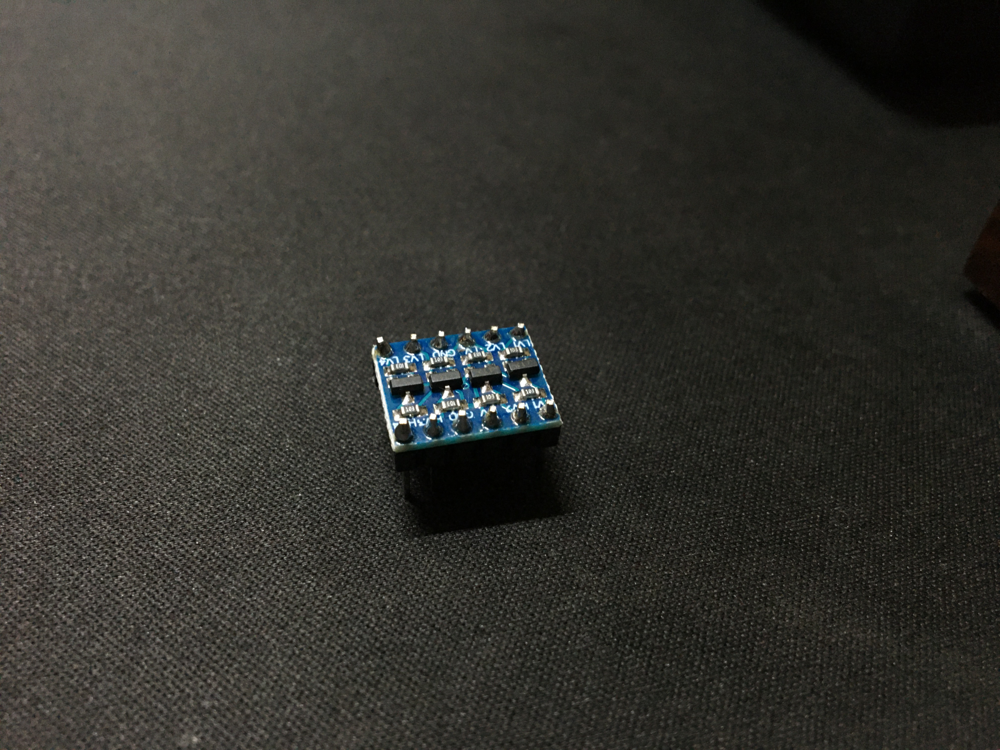

# An unfortunate predicament

Well, this blog was gonna be about me screwing around with the I2S peripheral on
the ESP8266 and getting it to drive some cool NeoPixels. Getting information
about this whole system proved to be quite challenging. Espressif's
documentation wasn't the best either. All I found was a crudely written MP3
decoder example on their GitHub.

I then ditched this whole endeavor in favour of some prewritten code (I know I
know, it ain't that exciting, but I need my blinky lights okay) specifically,
the NeoPixel driver that comes with micropython. I've never really used
micropython for anything else, figured this might be a good time to do so.

# On We Go

## A bit about how WS2812s work

The WS2812s are single line driven chainable LEDs, ie they are driven by one
signal line and can be chained together, like so.


VCC is the power pin for the control circuitry, this needs a tiny capacitor to
smooth out the fluctuations caused by the LED switching.

These LEDs take 8-bit color data and have three channels for Red, Green and Blue
(There're other variants with more channels for yellow, pure white and so on).
So it takes 24 bits to store information needed for 1 LED. The data composition
looks like so. Note that the color ordering is GRB and the most significant bit
is transmitted first.


Now lets talk about the signalling of 0s and 1s. Honestly I'll just slap in a
picture of the signalling from the data sheet itself since it indicates
everything pretty clearly.


| Label | Timing |
| --- | --- |
| T0H | 0.35us |
| T1H | 0.7us |
| T0L | 0.8us |
| T1L | 0.6us |

All these have tolerances up to +/-150ns.

## Getting Micropython up and running

This was fairly simple really. The instructions on the micropython website were
pretty straight forward, so I won't go into much detail about that here. I
downloaded the .bin file, The 2+ MB version for the nodemcu I was using which
has an ESP12-E module. Then flashed it using *esptool* with the following
command

```bash
esptool.py --port COM3 --baud 460800 write_flash --flash_size=detect 0 .\esp8266-v1.17.bin
```

## The Hardware Config

### Level shifting and power

Now that we have the software side of things set up, Its time for the hardware.
We run into our first problem here. The NeoPixel runs on a 5V power supply while
the esp run on 3.3V. The NeoPixels expect 5V logic levels too. We will be using
a level shifter to get this done.



The level shifter consists of voltage dividers and MOSFETS (The particular one I
have at least). It uses the divider circuit when shifting levels down and the
MOSFET when shifting levels up. You could for sure build something like this on
a breadboard, but I found this small little shifter module to be incredibly
convenient. The ability to shift 6 signals in this tiny package is just :`).

<!-- TODO: INSERT CIRCUIT DIAGRAM OF THE WHOLE THING -->

### REPL over putty and loading programs

Micropython on the ESP8266 by default, has a REPL *(Read Evaluate Print Loop)*
over serial, We will be using this to interact with the chip and to load our
programs. Now interacting with the file system, editing files on the esp using
the REPL kinda sucks to be honest. Python was not meant to be a shell, so well
be using a program called __ampy__ to make our lives easier.

Ampy lets us copy files back and forth between the ESPs internal file system and
our computer. We need to disable debugging on the ESP to get Ampy working tho.
(The debug messages interfere with Ampy ig) This can be done by adding the
following to the `boot.py` file on the ESP

```python
import esp
esp.osdebug(None)
```

Now you can simply run something like 

```bash
ampy --port COM3 --baud 115200 put main.py
```

to copy over files to the ESP

## On Forth Blinky Lights

And heres a tiny program I wrote to draw a rainbow.

```python
import machine, neopixel, math

np = neopixel.NeoPixel(machine.Pin(2), 24)

def hsv_to_rgb(hue, sat, val):
	h = float(hue)
	s = float(sat)
	v = float(val)
	h60 = h / 60.0
	h60f = math.floor(h60)
	hi = int(h60f) % 6
	f = h60 - h60f
	p = v * (1 - s)
	q = v * (1 - f * s)
	t = v * (1 - (1 - f) * s)
	r, g, b = 0, 0, 0
	if hi == 0: r, g, b = v, t, p
	elif hi == 1: r, g, b = q, v, p
	elif hi == 2: r, g, b = p, v, t
	elif hi == 3: r, g, b = p, q, v
	elif hi == 4: r, g, b = t, p, v
	elif hi == 5: r, g, b = v, p, q
	r, g, b = int(r * 255), int(g * 255), int(b * 255)
	return (r, g, b)

def rainbow(np):
	n = np.n
	for i in range(n):
		np[i] = hsv_to_rgb(float((float(i)/float(n)*360.0)), 1, 1)
	np.write()


while True:
	rainbow(np)
```


# Digging a bit deeper

The very reason I wanted to drive the WS2812s using DMA was to be able to
manipulate GPIOs in a more robust manner, basically with no involvement of the
CPU. I'm not even sure whether its possible with high level MicroPython.
Nonetheless, I dig a bit deeper into how the Micropython NeoPixel driver is
implemented. You can stop reading here onwards since this goes into a domain
beyond driving NeoPixels. Read on for a fun adventure.

## machine.bitsteam

The NeoPixel driver is implemented using bitstreams. machine.bitstream() is a
neat little function that lets you shift out bits off of a GPIO with precise
timing (+/-30ns in the ESPs case). Unfortunately this whole function is
synchronous ie, code execution will halt until all the bits are shifted.

```python
machine.bitstream(pin, encoding, timing, data)
```

The ESP specific implementation can be found at
[machine_bitstream.c](https://github.com/micropython/micropython/blob/master/ports/esp8266/machine_bitstream.c).

## An Asynchronous machine.bitstream?

Unfortunately Micropython doesn't implement support for the I2S peripheral of
the ESP8266 (Availability exists for the ESP32 though). One would have to
implement this in order to shift bits out of a GPIO asynchronously. Hell even
[I2C](https://docs.micropython.org/en/latest/esp8266/quickref.html#i2c-bus) is
implemented using software on the ESP8266.

Who knows, this might be something I would explore in a future blog post ;)